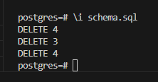
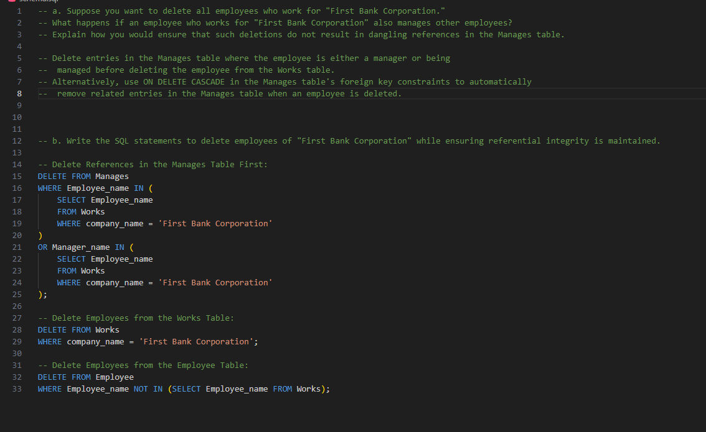

# DSC_E3.20

a. Suppose you want to delete all employees who work for "First Bank Corporation."
What happens if an employee who works for "First Bank Corporation" also manages other employees? 
Explain how you would ensure that such deletions do not result in dangling references in the Manages table.

Delete entries in the Manages table where the employee is either a manager or being managed before deleting the employee from the Works table.
Alternatively, use ON DELETE CASCADE in the Manages table's foreign key constraints to automatically remove related entries in the Manages table when an employee is deleted.

b. Write the SQL statements to delete employees of "First Bank Corporation" while ensuring referential integrity is maintained.

